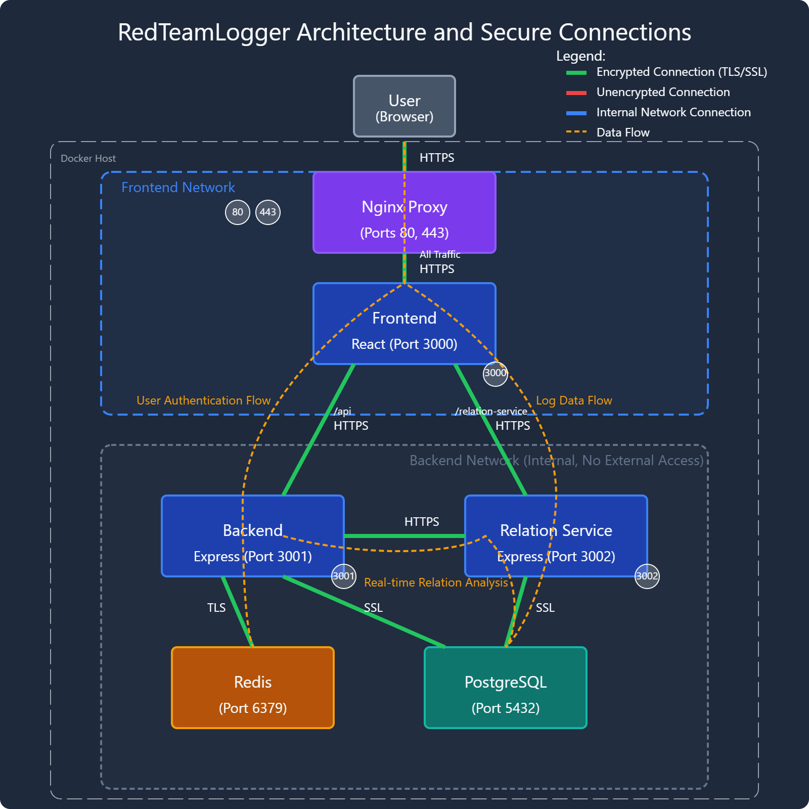

# Architecture Overview

Clio uses a microservices architecture with four primary components designed for security, scalability, and clear separation of concerns.

## System Architecture

The application consists of the following services:

1. **Nginx Proxy**: HTTPS termination and traffic routing to the frontend
2. **Frontend**: React-based UI with real-time data visualization and API routing
3. **Backend**: Core API service for authentication and logging operations
4. **Relation Service**: Analysis service that builds relationships between log entries
5. **Redis**: Session management and caching
6. **PostgreSQL**: Relational database for persistent storage

The Nginx proxy serves as the initial secure gateway, terminating HTTPS connections with proper certificates (either Let's Encrypt or self-signed). It forwards all traffic to the frontend service, which then acts as an intelligent router to both backend services via a proxy configuration. This ensures that only the frontend server communicates with backend services, while the backend and relation-service remain protected internally.

## Network Security

- Only the Nginx proxy ports (80, 443) are exposed to external connections
- Frontend, backend and relation-service ports are only accessible within the Docker network
- All external requests are proxied through Nginx to the frontend
- The frontend then proxies API requests to the appropriate backend services
- TLS certificates are used for all inter-service communication

After deployment, the following services will be running:

- **Nginx Proxy**: http://localhost:80 and https://localhost:443 (exposed to users)
- **Frontend**: https://frontend:3000 (internal only)
- **Backend**: https://backend:3001 (internal only)
- **Relation Service**: https://relation-service:3002 (internal only)
- **Redis**: rediss://redis:6379 (internal only)
- **PostgreSQL**: postgres://db:5432 (internal only)

## Technology Stack

### Nginx Proxy
- **Nginx Alpine**: Lightweight web server and reverse proxy
- **Let's Encrypt integration**: For production-grade SSL certificates
- **Automatic certificate selection**: Uses Let's Encrypt certificates when available, fallback to self-signed

### Frontend
- **React 19.0.0**: Latest version of React for UI components
- **Tailwind CSS 3.3.0**: Utility-first CSS framework
- **Lucide React 0.475.0**: Icon library
- **Modern JavaScript (ES6+)**: For frontend logic
- **HTTP-Proxy-Middleware**: For proxying API requests to backend services

### Backend
- **Node.js 23**: Server runtime environment
- **Express.js 4.18.2**: Web framework
- **PostgreSQL 17**: Relational database
- **Redis 7.4.2**: Session management and caching
- **JWT 9.0.2**: For secure authentication
- **Docker & Docker Compose**: For containerization and orchestration

### Relation Service
- **Node.js 23**: Server runtime environment
- **Express.js 4.18.2**: Web framework
- **Shared PostgreSQL database**: For data consistency across services
- **Specialized analysis algorithms**: For relationship mapping

## Data Flow

1. **Initial Connection**:
   - User connects to Nginx proxy via HTTPS
   - Nginx terminates SSL and forwards the request to the frontend service
   - Frontend serves the React application to the user

2. **User Authentication**:
   - User credentials are submitted to the frontend
   - Frontend proxies the request to the backend via the `/api/auth` path
   - Backend validates credentials and issues a JWT token
   - Token is stored as an HTTP-only cookie

3. **Log Operations**:
   - Log entries are submitted through the frontend
   - Frontend proxies the request to the backend via the `/api/logs` path
   - Backend handles CRUD operations and persistence
   - Changes are logged to audit trails
   - Frontend proxies requests to relation service as needed via the `/relation-service/api` path
   - Relation service analyzes logs to build relationship graphs

4. **API Integration**:
   - External tools authenticate using API keys
   - Log data is submitted through the Nginx proxy to the `/ingest` endpoint
   - Frontend proxies these requests to the backend service 
   - Backend validates, sanitizes, and stores the data
   - Audit events track all API operations

5. **S3 Integration**:
   - Log archives are automatically exported to S3 during rotation
   - AWS SDK handles secure uploads with proper credentials
   - S3 exports can be triggered manually or automatically
   - Configuration is stored in the data directory
   - Pre-signed URLs are used for reliable uploads

## Containerization

All services are containerized using Docker, with configuration managed through Docker Compose. This approach ensures:

- Consistent environments across development and production
- Isolated service dependencies
- Simplified deployment and scaling
- Clear separation of concerns

## SSL/TLS Handling

Clio supports two certificate types:

1. **Self-signed certificates**: Used for development environments
   - Generated automatically during setup
   - Used for all inter-service communications
   - Used for frontend if Let's Encrypt is not configured

2. **Let's Encrypt certificates**: Used for production environments
   - Can be configured during setup with the `--letsencrypt` flag
   - Automatically renewed via cron jobs
   - Used by Nginx for external connections
   - Self-signed certificates still used for internal service communication